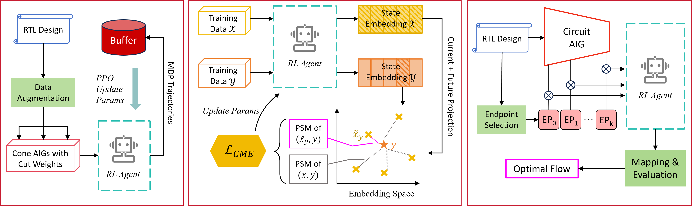

# GearLS
Source code of paper: ***GearLS: Generalizable Reinforcement Learning Framework for Logic Optimization via Policy Similarity Metric*** (under review)

All codes would be released as soon as the paper is published. 
